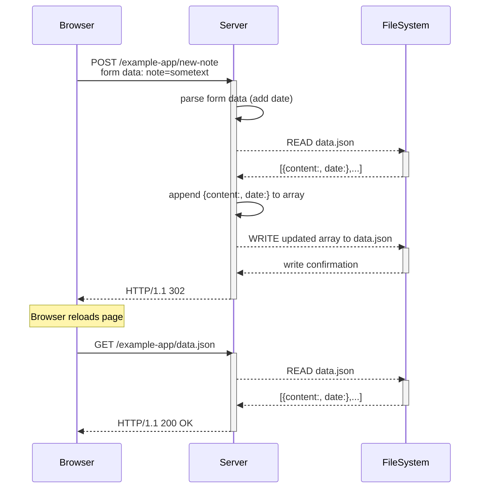

```mermaid
sequenceDiagram
    participant Browser
    participant Server
    participant FileSystem

    Browser->>Server: POST /example-app/new-note<br/>form data: note=sometext
    activate Server

    Server->>Server: parse form data (add date)
    Server-->>FileSystem: READ data.json
    activate FileSystem
    FileSystem-->>Server: [{content:, date:},...]
    deactivate FileSystem

    Server->>Server: append {content:, date:} to array
    Server-->>FileSystem: WRITE updated array to data.json
    activate FileSystem
    FileSystem-->>Server: write confirmation
    deactivate FileSystem

    Server-->>Browser: HTTP/1.1 302
    deactivate Server

    Note over Browser: Browser reloads page

    Browser->>Server: GET /example-app/data.json
    activate Server

    Server-->>FileSystem: READ data.json
    activate FileSystem
    FileSystem-->>Server: [{content:, date:},...]
    deactivate FileSystem

    Server-->>Browser: HTTP/1.1 200 OK
    deactivate Server
```