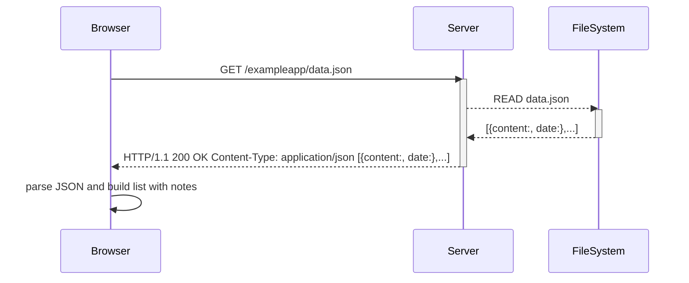

```mermaid
sequenceDiagram
    participant Browser
    participant Server
    participant FileSystem

    %% 1. On page load, browser fetches existing notes
    Browser->>Server: GET /exampleapp/data.json
    activate Server

    Server-->>FileSystem: READ data.json
    activate FileSystem
    FileSystem-->>Server: [{content:, date:},...]
    deactivate FileSystem

    Server-->>Browser: HTTP/1.1 200 OK Content-Type: application/json [{content:, date:},...]
    deactivate Server
	Browser->>Browser: parse JSON and build list with notes
```