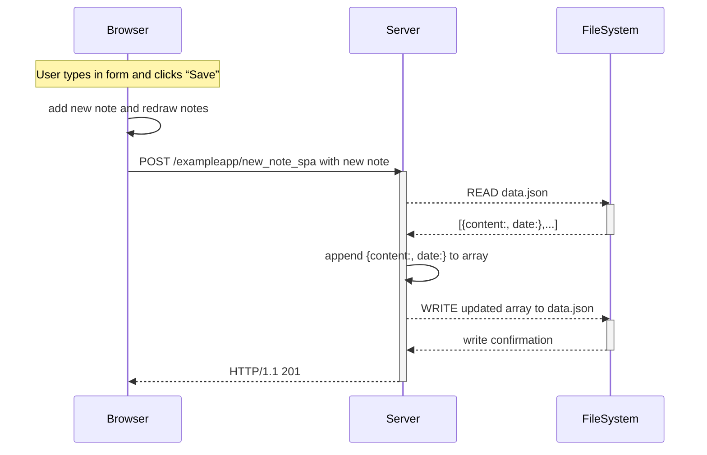

```mermaid
sequenceDiagram
    participant Browser
    participant Server
    participant FileSystem

    %% 1. User submits new note via form
    Note over Browser: User types in form and clicks “Save”

    Browser->>Browser: add new note and redraw notes

    %% 2. SPA sends new note to server asynchronously
    Browser->>Server: POST /exampleapp/new_note_spa with new note
    activate Server

    Server-->>FileSystem: READ data.json
    activate FileSystem
    FileSystem-->>Server: [{content:, date:},...]
    deactivate FileSystem

    Server->>Server: append {content:, date:} to array
    Server-->>FileSystem: WRITE updated array to data.json
    activate FileSystem
    FileSystem-->>Server: write confirmation
    deactivate FileSystem


    Server-->>Browser: HTTP/1.1 201
    deactivate Server
```